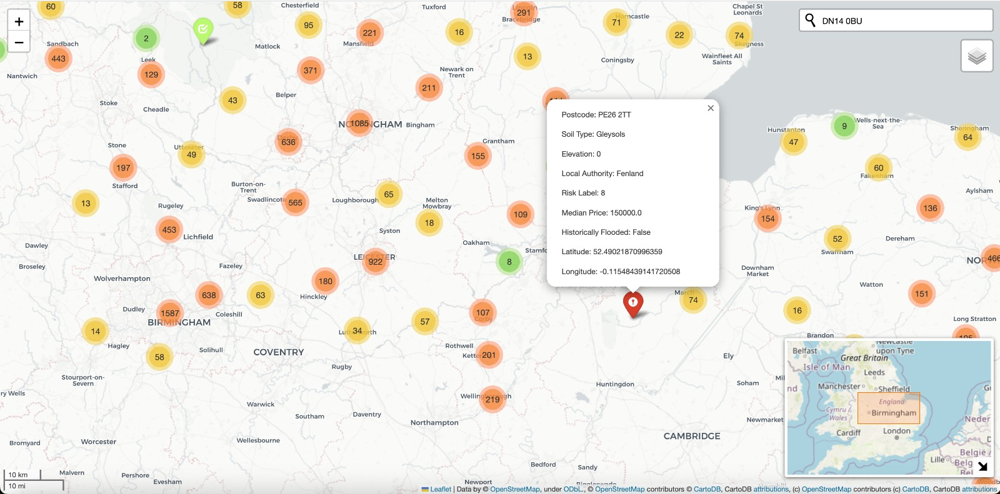
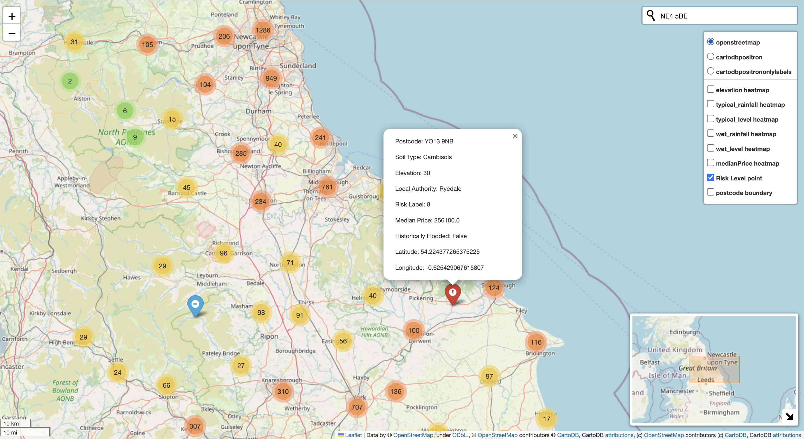
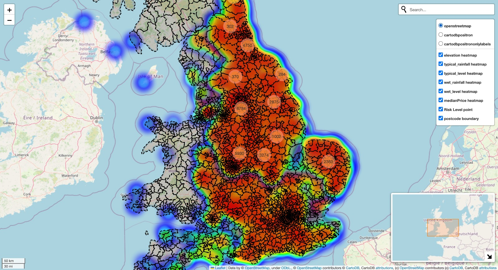
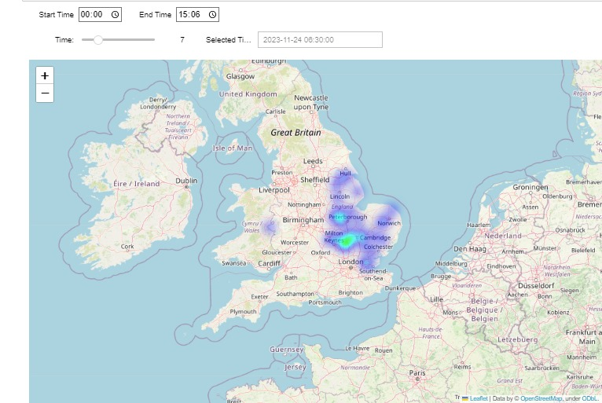

# <span style="color:red">⚠️</span><span style="color:">UK Flood Risk Prediction tool<span style="color:yellow">⚠️</span>

Use this package to predict flood risk in UK and visualize it in a map.



# Installation

Use the package manager [pip](https://pip.pypa.io/en/stable/) to install package.

Run the command below in the directory where flood_tool directory and setup.py are

```bash
pip install .
pip install imbalanced-learn
```
# Prediction
The `tool.py` module offers prediction tools for flood risk, property values, and local authorities etc.

## Setup

```bash
import flood_tool as ft

tool=ft.Tool()
```

## Key Features
<u>**Flood Risk Assessment**</u>: Predicts flood risk based on postcodes , OSGB36 locations (easting, northings) or WGS84_locations(latitudes,longitudes).
Specify the model name you want to use when do training or prediction.

When you predict from postcode, you can use:
| model name | meaning |
|--------|--------|
| RF_riskLabel_from_postcode | RandomForestClassifier |
| LR_riskLabel_from_postcode | Logistic Regression |
| KNN_riskLabel_from_postcode | K-Nearest Neighbours (KNN) |

When you predict from location, you can use:
| model name | meaning |
|--------|--------|
| RF_riskLabel_from_location | RandomForestClassifier |
| LR_riskLabel_from_location | Logistic Regression |
| KNN_riskLabel_from_location | K-Nearest Neighbours (KNN) |

```python
# example
tool.train(models=['RF_riskLabel_from_postcode'])

tool.predict_flood_class_from_postcode(postcodes=['NE29 7EN', 'S31 8QF', 'YO19 6HT'],method='RF_riskLabel_from_postcode')
```


<u>**Historic Flooding Prediction**</u>: Assesses the boolean of historic flooding based on postcodes.

| model name | meaning |
|--------|--------|
| MLP_historic_flooding | Multi-layer Perceptron (MLP) |
| RF_historic_flooding | Random Forest (RF) |
| KNN_historic_flooding | K-Nearest Neighbours (KNN) |

```python
# example
tool.train(models=['KNN_historic_flooding'])

tool.predict_historic_flooding(postcodes=['NE29 7EN', 'S31 8QF', 'YO19 6HT'],method='KNN_historic_flooding')
```


<u>**House Price Estimation**</u>: Estimates median house prices based on postcodes.

| model name | meaning |
|--------|--------|
| GBR_median_price | GradientBoosting Regressor (GBR) |
| KNR_median_price | KNeighbors Regressor (KNR) |
| RFR_median_price | RandomForest Regressor (RFR) |

```python
# example
tool.train(models=['GBR_median_price'])

tool.predict_median_house_price(postcodes=['NE29 7EN', 'S31 8QF', 'YO19 6HT'],method='GBR_median_price')
```


<u>**Local Authority Prediction**</u>: Estimates the local authority for OSGB36 locations (easting, northings).

| model name | meaning |
|--------|--------|
| KNN_local_authority | K-Nearest Neighbours (KNN)|
| SVC_local_authority | Support Vector Classifier (SVC) |
| RF_local_authority | Random Forest Classifier (RF) |

```python
# example
tool.train(models=['SVC_local_authority'])

tool.predict_local_authority(eastings = [445771, 395560],
    northings = [515362, 397900],method='SVC_local_authority')
```

## Auto-tuning of hyper parameters
If you want to autotune your hyper parameters best for you data, you can use auto-tuning by specifying that when you do training.

```python
# example
tool.train(
    models=['KNN_historic_flooding'],tune_hyperparameters=True
    )
```

## Ensemble voting
You can also use ensemble voting to search for best model for your data among 3 models provided.

```python
# example
tool.train(models=['KNN_local_authority', 'SVC_local_authority', 'RF_local_authority'],ensemble='soft')
```

```python
# example
tool.predict_local_authority(eastings = [445771, 395560],
    northings = [515362, 397900],method='ensemble')
```

# Visualisation
Run the command below in the directory where plot.py is.
```python
python plot.py
```


## Key Features

<u>**Risk Level Display**</u>: The tool visualizes flood risk levels.


<u>**Rainfall, Tidal, and River Data**</u>: Alongside flood risks, the tool integrates and visualizes rainfall data and other relevant environmental factors.


You can select the necessary information from the toolbar in the upper right corner.




<u>**Time data viewing**</u>: You can use Time-Based Data Filtering and Dynamic Map Updating.

Run the module `DataVisualization.py` in a iPython environment that supports Jupyter Notebook, as it uses IPyWidgets for interactive features.



## lon_lat_converter
This script is designed to convert coordinates from the British National Grid (BNG) projection to latitude and longitude in the WGS84 projection. 

```python
input_file_path = './flood_tool/resources/postcodes_labelled.csv'
output_file_path = './flood_tool/resources/lon_lat_post_labelled.csv'
convert_coordinates(input_file_path, output_file_path)
```


To run this converter you need to create two variables called `input_file_path` containing the address of the input csv
and `output_file_path` with the desired address of the new .csv file.

Lastly call `converted_coordinates(input_ file_path, output_file_path)` to run the function


# Contributing

Pull requests are welcome. For major changes, please open an issue first to discuss what you would like to change.

Please make sure to update tests as appropriate.
# License

[MIT](https://choosealicense.com/licenses/mit/)

[GeoLytics](https://geolytics.com/contract)
